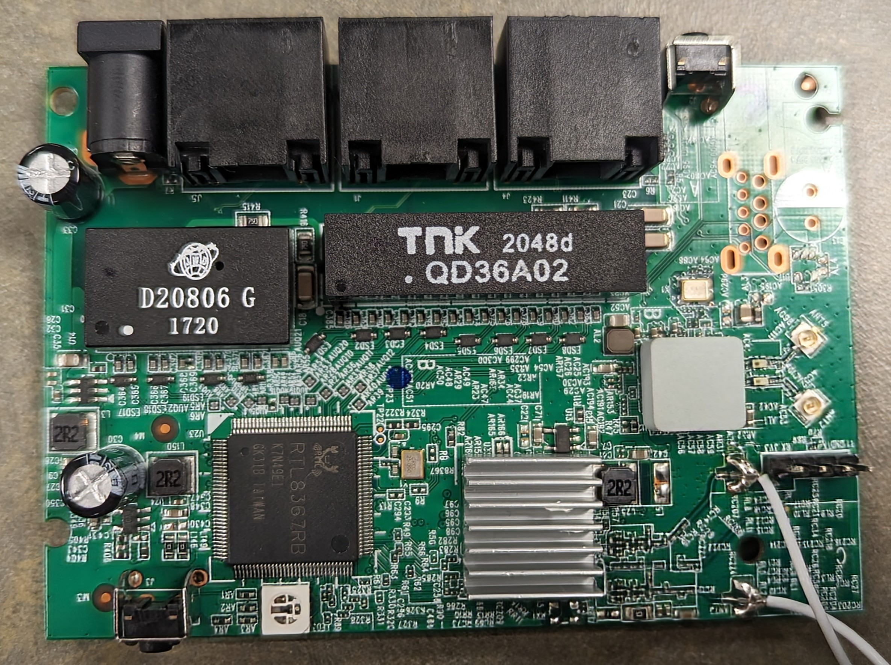
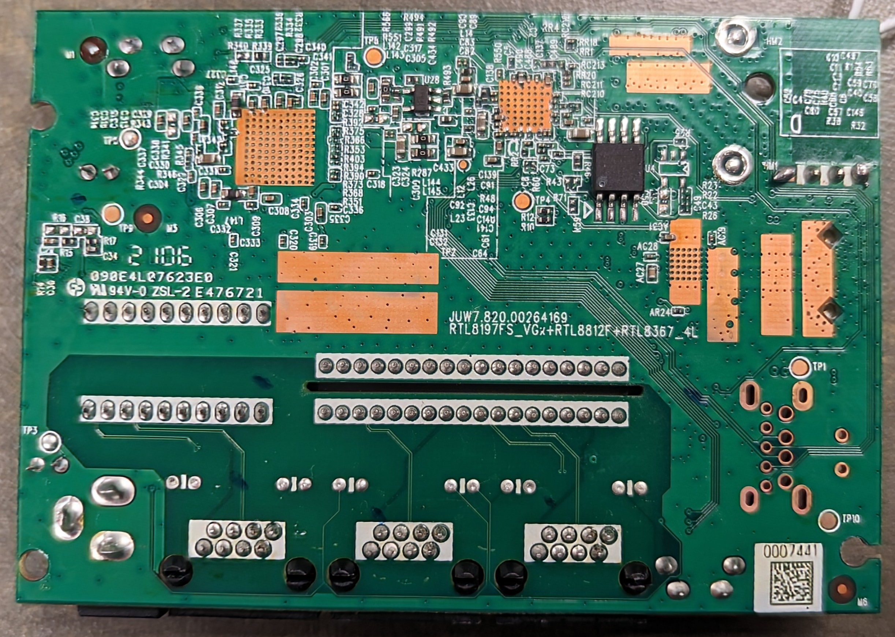
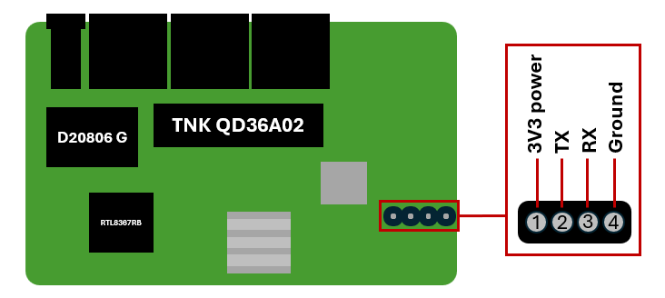
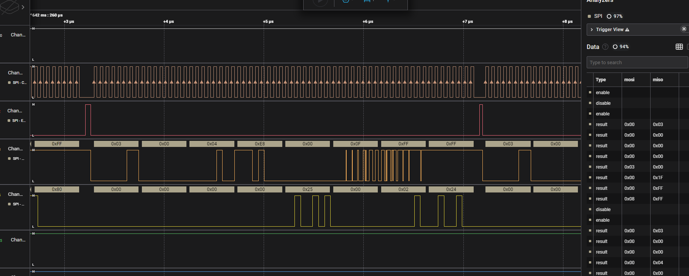

# Vilo Router
Our biggest breakthroughs in hacking the router came through physical vulnerabilities in the device hardware. We will attempt to document what we've discovered during this process. [This is a link to the FCC report](https://fcc.report/FCC-ID/2AZEWVLWF01) for the Vilo router which includes information about the device and internal photos.

First, here is a list of chips present on the device:
* [RTL8197FS](https://datasheet.lcsc.com/lcsc/2208171800_Realtek-Semicon-RTL8197FS-VE5-CG_C2916861.pdf) - CPU core
* [RTL8367RB-VB-CG](https://oshwhub.com/attachments/2020/8/EL5bC02iJACLzeu2pmX7SYubHPJ8COxvcW1ir7BA.pdf) - Ethernet switch
* JWD D20806 G - Network transformer
* [QD36A02 TNK](https://datasheet.lcsc.com/lcsc/1806011152_TNK-QD36A02_C216381.pdf) - RJ45 transformer
* [RTL8812FP](https://www.elinfor.com/pdf/RealtekMicroelectronics/RTL8812AU-CG-RealtekMicroelectronics.pdf) - WLAN controller
* [Winbond 25Q128JVSQ](https://www.winbond.com/hq/product/code-storage-flash-memory/serial-nor-flash/?__locale=en&partNo=W25Q128JV) - External flash memory chip

Here are some pictures of the device we have taken ourselves:






## UART Interface
After removing the plastic covering, we found a single SoC with 4 antennas attached (2 soldered, 2 popped on). On one of the edges, we found a UART interface right next to one of the soldered antenna wires. On one router, there was some high-temperature solder over some of the holes, but another router had them clear. We soldered pins onto the router and connected to the UART interface using a UART-to-USB serial adapter. Looking at the datasheet for the RTL8197FS CPU, we know the device uses the MIPS architecture and has a baud rate of 38,400.



### Router Boot Up
When the device is powered on, all sorts of boot information is printed to the console (see redacted [`boot.txt`](./resources/boot.txt)). If the device is fully set up, additional information is printed (see redacted [`boot2.txt`](./resources/boot2.txt)), including MQTT logs. Reading through the boot information displayed on the console gives us more information about the device, such as the following:

* The kernel version string is `Linux version 3.10.90 (jenkins@SWwubu14) (gcc version 4.4.7 (Realtek MSDK-4.4.7 Build 2001) ) #1 Tue Jun 1 13:30:40 CST 2021`, so a fairly old kernel version + the Realtek SDK was used
* The flash addresses for the external flash storage are:
```
6 rtkxxpart partitions found on MTD device m25p80
Creating 6 MTD partitions on "m25p80":
0x000000000000-0x0000002d0000 : "boot+cfg+linux"
0x0000002d0000-0x0000006f0000 : "rootfs"
0x0000006f0000-0x0000009c0000 : "boot+cfg+linux2"
0x0000009c0000-0x000000de0000 : "rootfs2"
0x000000de0000-0x000000fe0000 : "plugin"
0x000000fe0000-0x000001000000 : "cri_mib"
```
* The operating system is `BusyBox v1.13.4`
* The hostname is `rlx-linux`

After spitting out a bunch of debug information, you get a countdown timer that says `Waiting tty lock 30s...` and once those 30 seconds are over the UART interface is unresponsive. However, you have the opportunity to login locally in that short period and see some valueable MQTT logs. As of this writing, we have not cracked the root hash to enable us to login locally.

### Other UART Notes
When we discovered command injection through the router name in the app, we were able to use this to get RCE on the device. Each time the device was restarted, the unsanitized router app name was placed directly into a command and ran. See exploitation details [here](../software/Exfiltration.md), but we were able to kill the `tty_test` binary which locked the interface after 30 seconds, and we were able to see the output of this command injection.

It is also possible to open the proprietary Realtek bootloader prompt (second-stage bootloader) by pressing the reset button after the `---Realtek RTL8197F-VG boot code` line appears but before the kernel is started.

## External Flash Memory
Many IoT devices have external flash memory chips where the filesystem is stored. One way of recovering the firmware for the device is to attach to the flash memory and either actively pull it off, or passively observe all reads and writes from the CPU chip during boot. To physically connect to the chip, a SOIC-8 clip was attached to the 8 legs of the device, with wires coming from it. 

### Dumping the Firmware
To pull off the data located on the chip, we connected the wires to a Raspberry Pi and used the `flashrom` utility. The extracted value is saved as [`extracted_fw.bin`](./resources/extracted_fw.bin). After using a variety of utilities such as `binwalk`, `file`, and [binvis' entropy viewer](https://binvis.io/#/view/local?curve=scan), we are pretty sure this is a 32-bit little-endian MIPS n-stage bootloader made by Realtek that decrypts and/or decompresses the kernel and the filesystem. 

These are the sections we've been able to identify:

* `0x1000-0x2004` - assembly
* `0x3000-0x4010` - assembly
* `0x7000-0x70f0` - strings
* `0x70f0-0x8004` - assembly
* `0xf000-0x10008` - unknown data
* `0x11000-0x12008` - unknown data
* `0x13000-0x15610` - unknown data
* `0x1becc-0x1ce30` - unknown data

One notable discovery is that the strings in the section identified above are seen in the [`boot.txt`](./resources/boot.txt) output. Unfortunately, the total size of all the "unknown data" sections combined is just under 22 KB, which is not even close to enough to hold the filesystem. The `/bin` folder itself is 6 MB (which we discovered later). It's likely that the firmware we extracted is corrupted or incomplete. Therefore, we decided to monitor the reads/writes made by the CPU and move on (we found the full code later).

### Monitoring the Chip
The CPU chip uses the SPI protocol to communicate with the external memory chip. In our situation, dual SPI is used, meaning only 6 of the eight legs are used (2 of which are VCC and GND). We hooked our SOIC-8 clip to the chip and connected all 8 wires to a Saleae Logic Pro 8 logic analyzer. We set it to use the highest sampling rate possible, connected the analyzer to a laptop which had Saleae's Logic 2 software installed, and captured for approximately 100 seconds. We then plugged in the router and got a lot of data!!



Zooming in a lot displayed data like the data shown above. We saved the data to [`vilo_boot.sal`](./resources/vilo_boot.sal). We then used Logic 2's built-in SPI analyzer, and assigned each channel to a different leg of the chip. This gave us a large table like shown on the right in the picture above. We exported this data to a CSV file and saved it (compressed) to [`vilo_boot.csv.gz`](./resources/vilo_boot.csv.gz).

### Decoding SPI Data
Now we needed to analyze this data to see if we can pull any useful files from it. The datasheet for the Winbond external flash memory chip (linked at the top) describes how the SPI protocol works with this chip. Dual SPI has 4 channels (in the same order as the picture above):

* **Clock (CLK)** - each up/down identifies the length of a single bit in MOSI/MISO
* **Enable (/CS)** - each up/down ends the previous SPI instruction and starts a new one
* **MOSI (IO0)** - meaning "Master Out/Slave In", this channel is where the CPU chip sends an instruction (like read or write), followed by addresses and/or data
* **MISO (IO1)** - meaning "Master In/Slave Out", this channel is where the flash memory chip responds to the CPU chip instructions by sending data

There's a lot of data to unpack especially since there are about a dozen different instructions used, including multiple types of read/write. The general structure of SPI is a one-byte instruction will come from the MOSI channel followed by data (structured depending on the instruction). If the CPU wants to read, it will usually send the instruction `0x03` followed by a 3-byte address (taking up 4 bytes). The flash memory chip will then respond with a variable amount of data starting at the address specified through the MISO channel. Typically 4 bytes are returned, but it's possible that more could be sent. Once all the data is sent, the enable channel will change, marking the end of that instruction and prompting the CPU to send another instruction through MOSI.

Due to this protocol, turning the raw data into a usable format for finding files can be difficult. On one hand, if we just combine all of the data read and ignore addresses, non-sequential reads may give us garbled data. However, if we create an array as large as the filesystem and fill in bytes based on their address, then it's possible that multiple writes to a single address will lead to data being overwritten.

Our solution was to [script the retrieval using Python](./resources/parse_SPI.py) and keep track of the data both regardless of address (assuming most of the data is read sequentially) AND by placing the data in an array of bytes with the index being the address. We then wrote the data to [`data.bin`](./resources/data.bin) and [`fs.bin`](./resources/fs.bin) (respectively).

```python
lines = open('vilo_boot.csv','r').read().split('\n')[1:]
code_sections = []
fs = [0]*(0xffffff+4)
total_data_str = b''


# parse CSV
data1 = []
data2 = []
for line in lines:
    sections = line.split(',')

    if len(sections) > 1 and sections[1] == '"disable"':
        code_sections.append((b''.join([int.to_bytes(x) for x in data1]), b''.join([int.to_bytes(x) for x in data2])))
        data1 = []
        data2 = []

    if len(sections) > 1 and sections[1] == '"result"':
        data1.append(int(sections[2],16))
        data2.append(int(sections[3],16))

print(code_sections[1])

# parse instructions
for s in code_sections:
    bin = s[0]
    instr = s[1]

    if len(instr) == 0:
        continue
    mode = instr[0]

    if mode == 3:
        # read
        addr = instr[1:4]
        data = bin[4:]

        total_data_str += data

        for i in range(len(data)):
            fs[int.from_bytes(addr)+i] = data[i]

fs = b''.join([int.to_bytes(x) for x in fs])

with open('fs.bin','wb') as f:
    f.write(fs)

with open('data.bin','wb') as f:
    f.write(total_data_str)
```

Using binwalk to inspect both `fs.bin` and `data.bin` will reveal several compressed files and filesystems. Running `binwalk -e fs.bin` will reveal an entire squashfs filesystem which contains the root filesystem for the router!!

#### Notes About Decoded SPI Data
Analyzing the output from the data above connects a few dots:

* The boot output gathered from UART reveals the following breakdown of the external flash memory chip:
```
6 rtkxxpart partitions found on MTD device m25p80
Creating 6 MTD partitions on "m25p80":
0x000000000000-0x0000002d0000 : "boot+cfg+linux"
0x0000002d0000-0x0000006f0000 : "rootfs"
0x0000006f0000-0x0000009c0000 : "boot+cfg+linux2"
0x0000009c0000-0x000000de0000 : "rootfs2"
0x000000de0000-0x000000fe0000 : "plugin"
0x000000fe0000-0x000001000000 : "cri_mib"
```
* In addition, running `binwalk` on `fs.bin` has the following output:
```
DECIMAL       HEXADECIMAL     DESCRIPTION
--------------------------------------------------------------------------------
39192         0x9918          CRC32 polynomial table, little endian
40288         0x9D60          gzip compressed data, maximum compression, from Unix, last modified: 2021-04-28 08:49:30
337944        0x52818         LZMA compressed data, properties: 0x5D, dictionary size: 8388608 bytes, uncompressed size: 7676180 bytes
2949120       0x2D0000        Squashfs filesystem, little endian, version 4.0, compression:xz, size: 3157356 bytes, 734 inodes, blocksize: 131072 bytes, created: 2038-02-22 09:50:56
14548992      0xDE0000        JFFS2 filesystem, little endian
```
* According to the boot output, everything up to address `0x2d0000` is for booting, hardware configuration, and the Linux kernel. 
    * Although `binwalk` does not report much in this range, opening the data up in a hex editor shows that all the data up to address `0x97C0` is either 32-bit, little-endian, raw MIPS assembly code, or strings found in the boot output (specifically all the strings in `boot.txt` up until line 29). This is the first stage of a bootloader.
    * The CRC32 polynomial table goes from addresses `0x9918-0x9D18`.
    * There's a string present at `0x9D50` which is `v3.4.14b_mu`. This string is also present in `boot.txt`, specifically where it's announcing that it's running `Realtek RTL8197F-VG boot code`. Immediately afterward at address `0x9D60` is a gzip-compressed file which, when uncompressed, gives the compiled [Realtek bootloader code](https://openwrt.org/docs/techref/bootloader/realtek). This is the second stage of a bootloader.
    * At address `0x40000` is data marked with `COMPCS` which some [random online article](https://github.com/krzys-h/8level-WRT-1200AC-firmware-tools) states is the current bootloader config.
    * At address `0x50000` is data marked with `cr6c`, which is where the assembly that decompresses and runs the kernel is (also [see here](https://github.com/hackpascal/openwrt-rtk/blob/master/rtk_openwrt_src/tools/rtk-tools/src/apmib.h)). Note that address `0x52600` has strings found from lines 79-79 in `boot.txt`.
    * At address `0x52818` is an LZMA-compressed file which contains lots of data, most notably the Linux kernel version 3.10.90 used in the image.
* Binwalk's analysis of `fs.bin` shows that a Squashfs filesystem is located at address `0x2D0000`, which lines up exactly with the `rootfs` partition. Note that this partition is also read-only.
* It also shows that a JFFS2 filesystem is located at address `0xDE0000`, which lines up exactly with the `plugin` partition. Later analysis revealed that the `/hualai` directory is the only writable directory, and is a JFFS2 filesystem, meaning this folder is sitting in this partition.
* Further analysis of the filesystem reveals that `libapmib.so` and `libcapi.so` (which contains several functions starting with `cri_`) are the two most common libraries used, and these keep track of the router's internal state. It's likely that the `cri_mib` partition is written with data from these libraries upon reboot so the router's state will persist.