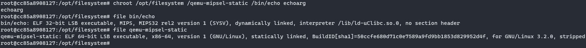
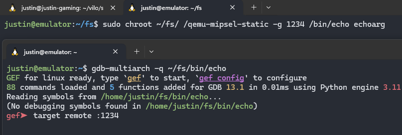
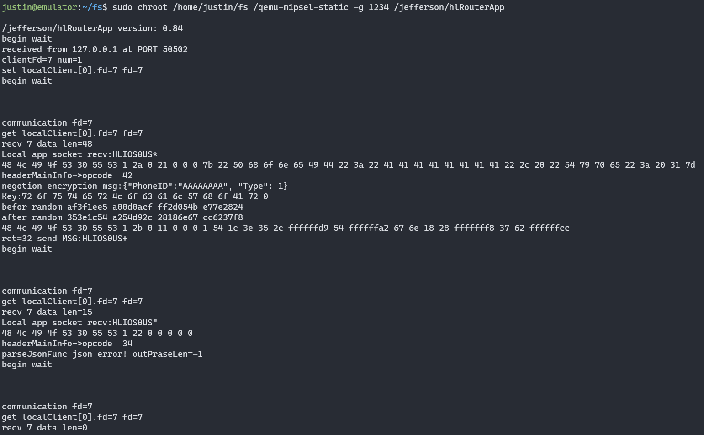

# Vilo Firmware Emulation
The output for the `file` command on compiled binaries like `hlRouterApp` is:

```
hlRouterApp: ELF 32-bit LSB executable, MIPS, MIPS32 rel2 version 1 (SYSV), dynamically linked, interpreter /lib/ld-uClibc.so.0, no section header
```

This means these binaries contain 32-bit, little endian MIPS assembly (rel2 specifically) using `uClibc` as their library and not `Glibc`. To run these on an x86 machine, the use of [qemu](https://www.qemu.org/) is required.

## Building an Emulation Environment
For the purposes of this walkthrough, I'm going to assume you are using the latest Ubuntu or other Debian-based Linux distribution. I would recommend allocating an entire virtual machine with a good amount of space and resources for this task. Copy over the entire filesystem of the device to your VM to a folder somewhere like `/opt` or your home directory. 

When running the dynamically-linked binaries, it's important that the linked libraries are available in the locations the binary expects them to be (`/lib`, `/usr/local/lib`, etc.). Since those libraries are only stored in a local directory, we will use `chroot` to change the "root" directory to the folder with our filesystem. For example, if our filesystem is stored in `/opt/filesystem`, we will run `sudo chroot /opt/filesystem <command>`. 

Since our x86 machine can't run MIPS assembly, we need qemu to emulate the MIPS environment. Since we are running chroot, we need a statically-compiled version of qemu so qemu doesn't rely on any libraries. The latest version can be grabbed from [their GitHub repo](https://github.com/multiarch/qemu-user-static/releases) (make sure to get `qemu-mipsel-static`). This file should be placed in the filesystem also. For example, I ran `wget https://github.com/multiarch/qemu-user-static/releases/download/v7.2.0-1/qemu-mipsel-static -O /opt/filesystem/qemu-mipsel-static`.

The last step is to put everything together. To run a command located at `/opt/filesystem/bin/echo`, you would then run `sudo chroot /opt/filesystem /qemu-mipsel-static /bin/echo echoarg` (and it works!). Note that the paths to `qemu` and `echo` are treated as absolute in the new `chroot` setup. 



## Debugging the Firmware
Qemu has several nice features built in, such as GDB debugging and `strace` functionality. To debug the running firmware with GDB, run the following command in one terminal - `sudo chroot /opt/filesystem /qemu-mipsel-static -g 1234 /bin/echo echoarg`. You'll notice this hangs - that's because qemu is waiting for a GDB client to connect over the network at port 1234 to debug the process before actually running the `echo` command. In another terminal, run the command `gdb-multiarch -q /opt/filesystem/bin/echo` (ensure `gdb-multiarch` is installed by running `sudo apt install gdb-multiarch`). `gdb-multiarch` is different than regular `gdb` because it allows you to debug architectures other than x86. The `-q` argument (for quiet) is optional, and the path to `echo` is passed in so you have symbols from the `echo` binary.

In the GDB terminal window, run `target remote :1234` to attach to the network GDB debugging session started by `qemu`. At this point, no assembly instructions have been run, so you can set breakpoints and use GDB normally. This setup is nice because you don't need any MIPS-compiled GDB dependencies, but it rather uses the GDB setup on your x86 VM. I like using the GEF extension for GDB, so I installed that extension and dependencies on my VM and it works great!



I must note that not all the same features are available as normal due to the setup. For example, `vmmap` or `info proc mappings` may not display properly. Running `cd /opt/filesystem && sudo mount -t proc /proc proc/` will mount your `/proc` folder to `/opt/filesystem/proc` so the `chroot` environment will have access may help in some situations.

Also note that all output and input for the program is handled in the qemu terminal window, not the GDB window.

## Fixing Emulation Issues
Many times, emulating firmware or binaries like this will lead to errors because of certain failing library calls or different hardware setups. These almost always require custom modifications to the binary through patching or overriding library calls through `LD_PRELOAD` to fix or avoid problematic areas. 

In older versions of Vilo firmware, the TCP service run on port 5432 was administered through the `hlRouterApp` binary; in newer versions, it's ran through the `iperf3` binary (both in `/hualai`). Most of our reverse engineering has been done in non-stripped versions of these executables found in an older release (located in [`./firmware/hualai-not-stripped`](./firmware/hualai-not-stripped/)), and the function that starts the TCP service is called `monitor_app_local_connection()`. 

Luckily, this function doesn't depend too much on previous setup from previous functions, so this service can be locally emulated by running the binary and skipping directly to this function. I did this by following the instructions in the "Debugging the Firmware" section above (for either `hlRouterApp` or `iperf3` depending on the firmware version); once I was connected to the remote debugging session, I ran the following commands:

```
break *0x405154
c
set $pc = monitor_app_local_connection
c
```

The hard-coded address will differ based on the version of the firmware you are emulating. What these commands do is place a breakpoint at the first function called in `main()`, run until that point, and set the instruction pointer to the `monitor_app_local_connection` function and run. Note that if you're using a stripped version of `hlRouterApp`/`iperf3`, you'll need to put the address of that function instead (PIE is disabled on all versions we've seen).



Now you can open up a terminal in a third window and interact with the custom TCP service on port 5432! Please note that any opcodes that requires XXTEA decryption will not work properly, so I had to patch the binary so all opcode functions didn't require encryption.